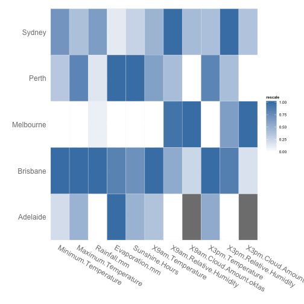
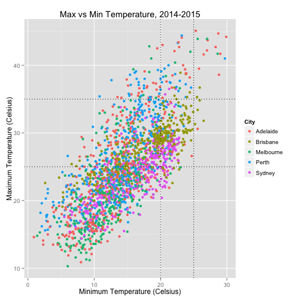
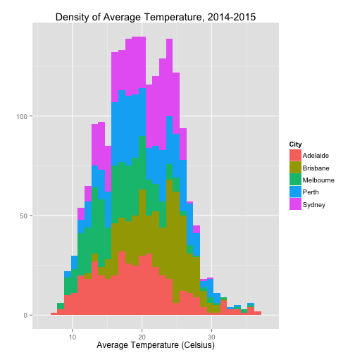
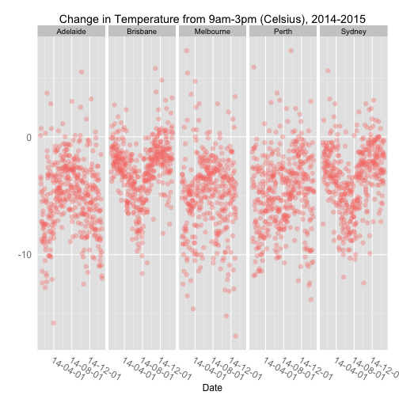
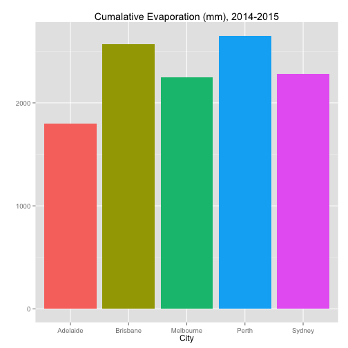
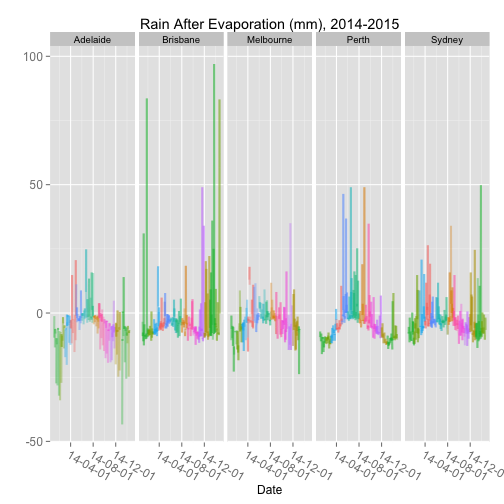
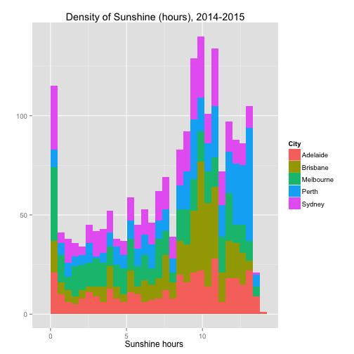
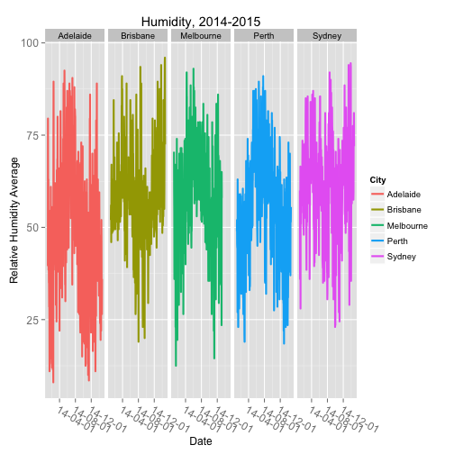
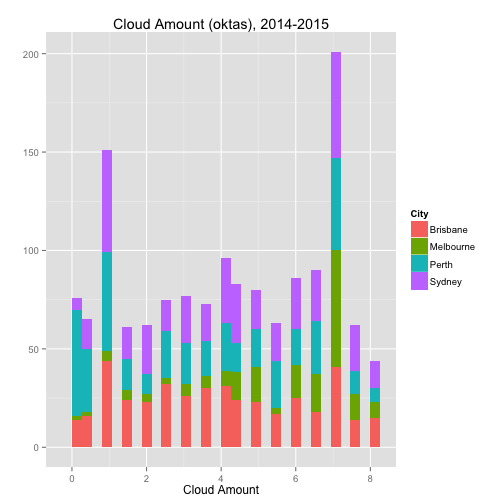

Which Australian capital city has the best weather?
========================================================

The following were initial tables and graphs to better understand the data. This is a rough draft; this document was made in quickly without thorough proofreading.

## Heatmap Summary

A heatmap displaying all relevant variables against the cities. The darker the colour for a particular city, the higher the value in relation to peer cities.

Values were calculated based on a yearly average of all the data.

 

\*Note: Adelaide has no data for 3am.Cloud and 9am.Cloud

For instance, Brisbane clearly has the darkest values for most variables. This means in relation to other cities, it had the highest values. Melbourne, on the other hand, had the lowest values for most variables.

\newpage

## Temperature

Temperature plotted with the Minimum against the Maximum.

Intercepts were added to isolate an ideal minimum temperature range of 20-25 Celcius and maximum temperature range of 25-35.

 

56 rows containing missing values were removed when plotting this graph.

With this, Brisbane appears to be isolated in the desired region (box created by 4 intercepts). We can further explore this in a density plot to confirm \(following page).

\newpage

The density plot is a great way to observe the concentration of data points across a variable.

The average temperature was obtained by calculating the average of Maximum and Minium temperature. This provided a more comprising metric to summarise the data.

 

Brisbane had the highest minimum and maxiumum temperature. All cities share a similar pattern of temperature density.

\newpage

In order to obersve how irratic the temperature was throughout the year. A difference was determined by subtracting the temperature in the morning (9am) from temperature in the afternoon (3pm).

This difference shows how much the temperature reduced as the day progressed by 6 hours.

 

57 Rows contain missing values were removed.

Once more, Brisbane appears to show the most desirable temperature, as it has the least change throughout the day (going lower).

\newpage

## Rainfall & Evaporation

From the bar graph below sums the rainfall for every city throughout the year. It can be observed that Brisbane had the highest amount of rainfall during the year, where as Melbourne had the least.

 

142 rows containing missing values were removed when plotting this graph.

\newpage

Results from evaporation showed that Brisbane had the highest, and Adelaide had the least.

 

142 rows containing missing values were removed when plotting this graph.

\newpage

The graph below was an attempt to summarise rain and evaporation by subtracting evaporation from rain. 

It was suprising to find that generally the level of evaporation was higher than rainfall as this yielded some negative results. 

It was beyond my circle of competence to use this specific metric as an indicator.

Colours indiciate a different month.

 

51 rows contained missing values were removed when plotting this graph.

\newpage

## Sunshine Hours

The graph below shows the density of sunshine hours throughout the year.

It can be observed that Perth has the highest density of the most sunshine hours.

 

\newpage

## Relative Humidity

The humidity indiciator was calculated by getting the average of relative humidity at 9am and 3pm.

 

54 Rows were removed when plotting this graphs.

\newpage

## Cloud Amount

The cloud amount metric was calculated by getting the average of oktas at 9am and 3pm.

Adelaide had no data, and Perth had the lowest cloud amount.

 

